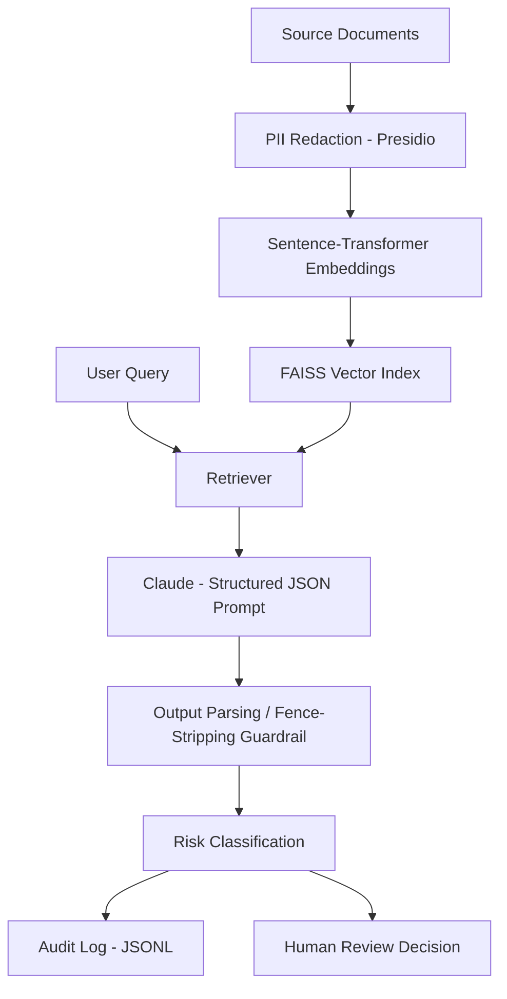

# LLM Compliance Document Agent

**RAG-Based Risk Triage Agent with PII Guardrails and Audit Logging**

A retrieval-augmented agent that ingests financial/compliance documents, retrieves relevant context, classifies risk, and decides whether a human needs to review it — with PII redaction and full audit logging built in as guardrails rather than afterthoughts.

Instead of trusting the LLM's output blindly, this project treats the model as one untrusted step in a pipeline: redact before it sees anything sensitive, validate what it returns, and log everything for traceability.

---

## What This Project Does

A user can ask a question such as:
> What is the litigation risk described in these documents?

The agent then:

1. Redacts PII from source documents before any LLM call.
2. Embeds redacted documents into a FAISS vector index.
3. Retrieves the most relevant document(s) for the query.
4. Sends retrieved context to Claude with a strict structured-output prompt.
5. Parses and validates the JSON response (with a fallback for markdown-wrapped output).
6. Classifies risk category and flags items for human review based on confidence and category.
7. Logs every query/response pair to an audit trail.
8. Reports operational metrics (review rate, average confidence) as a KPI.

---

## Key Results

| Metric | Result |
|---|---|
| Human review escalation rate | 33% |
| Average model confidence | 0.92 |
| Risk categories correctly distinguished | regulatory / complaint / contract_terms / other |
| PII redaction — caught | names, email addresses |
| PII redaction — missed on first pass | SSNs, masked account numbers |

The redaction gap is a documented finding, not a hidden flaw — see [Guardrail Evaluation](#guardrail-evaluation) below.

---

## Architecture



### Production mapping

Local (this repo) Production equivalent
```mermaid
Synthetic .txt docs --> Real document ingestion pipeline
FAISS local index --> Managed vector DB / Snowflake Cortex
Direct API key --> Secrets manager + key rotation
JSONL audit log --> Centralized logging (Splunk / CloudWatch)
Manual eval --> Labeled eval set + CI regression tests

```
---

## Guardrail Evaluation

### PII Redaction

Presidio's default recognizers were tested against three synthetic documents containing a name, SSN, email, phone number, and masked account number.

| PII type | Detected? |
|---|---|
| Person name | Yes |
| Email address | Yes |
| SSN (`123-45-6789`) | No |
| Phone number | Mistagged as a UK NHS number, not removed as a phone number |
| Masked account number ("account ending 4471") | No |

**Finding:** default entity recognizers reliably catch names and emails but miss financial-sector-specific formats like SSNs and masked account numbers. A production version would need custom regex recognizers registered with Presidio's `AnalyzerEngine` for these patterns.

### Output Parsing

Claude was instructed to return JSON only, but consistently wrapped output in ` ```json ` markdown fences despite explicit instructions not to. A regex-based fence-stripping step was added before `json.loads()` to handle this reliably. This is treated as a general lesson: strict schema compliance can't be assumed from prompt instructions alone — a production system would use tool-calling or a JSON schema constraint instead of prompt-only formatting.

---

## Agent Behavior

Example queries and outcomes:

| Query | Risk category | Confidence | Human review? |
|---|---|---|---|
| "What is the litigation risk described?" | regulatory | 0.95 | Yes |
| "Summarize the customer complaint." | complaint | 0.95 | No |
| "What are the loan's interest terms?" | other | 0.85 | No |

The agent correctly escalated the regulatory item while auto-resolving routine queries, showing category-sensitive judgment rather than flat behavior.

---

## Tech Stack

### AI and Retrieval
- Anthropic API (Claude)
- sentence-transformers (`all-MiniLM-L6-v2`)
- FAISS
- Microsoft Presidio (analyzer + anonymizer)

### Core
- Python 3
- pandas
- spaCy (`en_core_web_lg`)

---

## Local Setup

### 1. Clone and set up the environment

```bash
git clone https://github.com/siankop22/llm-compliance-agent.git
cd llm-compliance-agent
python3 -m venv venv
source venv/bin/activate
pip install anthropic sentence-transformers faiss-cpu pandas presidio-analyzer presidio-anonymizer spacy
python3 -m spacy download en_core_web_sm
export ANTHROPIC_API_KEY="your_key_here"
```

### 2. Run the agent

```bash
python3 agent.py
```

This redacts the sample documents, builds the FAISS index, runs three test queries through the agent, and appends results to `data/redacted/audit_log.jsonl`.

### 3. Check evaluation metrics

```bash
python3 - <<'EVALEOF'
import json
log = [json.loads(l) for l in open("data/redacted/audit_log.jsonl")]
review_rate = sum(1 for e in log if e["result"].get("needs_human_review")) / len(log)
avg_conf = sum(e["result"].get("confidence",0) for e in log) / len(log)
print(f"Human review rate: {review_rate:.0%}")
print(f"Average confidence: {avg_conf:.2f}")
EVALEOF
```

---

## Synthetic Data Notice

All documents in this repository are **synthetically generated** for demonstration purposes, including fake PII used solely to test the redaction guardrail. No real customer or company data is included.

---

## What I'd Change for Production

- Custom regex recognizers for SSNs and masked account numbers to close the redaction gap
- Structured output via tool-calling or a JSON schema instead of prompt-only formatting
- A larger, human-labeled evaluation set (10-20+ queries) with precision/recall on `risk_category`
- Centralized audit logging instead of a local JSONL file
- Secrets management for the API key instead of a shell environment variable

---

## Project Purpose

This project demonstrates an end-to-end applied GenAI workflow across:

- retrieval-augmented generation (RAG)
- agentic decision-making (risk classification + escalation)
- prompt engineering and output-format guardrails
- PII detection and redaction
- audit logging and operational KPI evaluation
- honest evaluation of guardrail limitations
